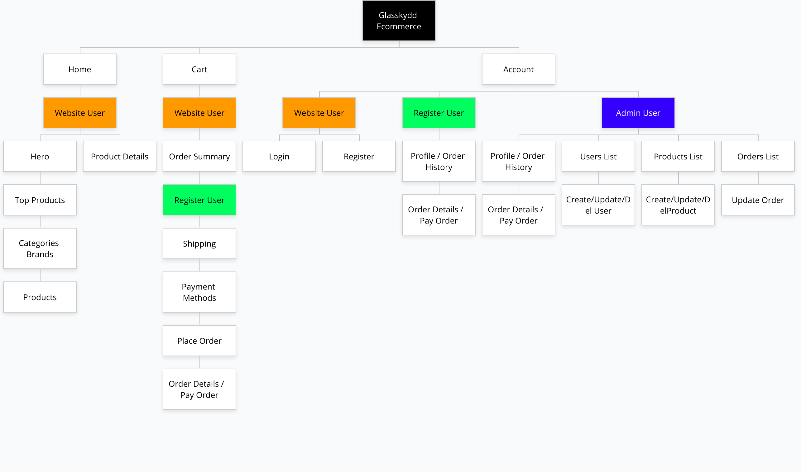

<!-- PROJECT LOGO -->
<br />
<p align="center">
  <!-- <a href="https://github.com/">
    
  </a> -->

  <h3 align="center">Glasskydd E-commerce -MERN</h3>

  <p align="center">
    This e-commerce has full featured shopping cart with PayPal payments. Product rating, reviews, product search, pagination. Admin area to manage customers, products and orders. Build with React, Redux, Node, Express and MongoDB.  
    <br />
    <br />
    · <a href="https://glasskydd.netlify.app/" target="_blank">View Demo</a>
    ·
    <a href="https://github.com/cimp08/ecommerce-be" target="_blank">Backend GitHub Repository</a>
    ·
    <a href="https://www.figma.com/file/uK1tRqiK8zJKoutFzgrMso/glasskydd?node-id=0%3A1" target="_blank">Figma Wire Frames</a>
    ·
  </p>
</p>

<!-- TABLE OF CONTENTS -->
<details open="open">
  <summary>Table of Contents</summary>
  <ol>
    <li>
      <a href="#about-the-project">About The Project</a>
      <ul>
      <li><a href="#deployment">Deployment</a></li>
        <li><a href="#built-with">Built With</a></li>
        <li><a href="#naming-conventions">Naming Conventions</a></li>
        <li><a href="#code-conventions">Code Formating</a></li>
      </ul>
    </li>
    <li>
      <a href="#getting-started">Getting Started</a>
      <ul>
        <li><a href="#installation">Installation</a></li>
      </ul>
    </li>
    <li><a href="#requirements-specification">Requirements specification</a></li>
    <li><a href="#sitemap">Sitemap</a></li>
    <li><a href="#roadmap">Roadmap</a></li>
    <li><a href="#license">License</a></li>
    <li><a href="#contact">Contact</a></li>
  </ol>
</details>

<!-- ABOUT THE PROJECT -->

## About The Project

The goal of this assignment was to create a e-commerce that uses the knowledge and skills required to go from an idea and concept phase to a complete application. The submission should demonstrate understanding of, application, and use of a RESTful API in node with JWT-based authentication with the MongoDB document database.

### Built With

- [React.js](https://reactjs.org/)
- [React Redux](https://react-redux.js.org/)
- [React Bootstrap](https://react-bootstrap.github.io/)
- [NodeJS](https://nodejs.org/en/)
- [ExpressJS](https://expressjs.com/)
- [MongoDB](https://www.mongodb.com/)

### Deployment

Backend is deployed with Render’s free plan that automatically spun down after 15 minutes of inactivity. When a new request for a free service comes in, Render spins it up again so it can process the request.
This can cause a response delay of up to 30 seconds for the first request that comes in after a period of inactivity.

### Naming Conventions

| Name        | Example          | Usage                             |
| ----------- | ---------------- | --------------------------------- |
| kebab case  | is-not-a-dish    | style classes                     |
| pascal case | AllInOneCapitals | components, jsx pages             |
| camel case  | goesDownThenUp   | jsx variables, css files          |

### Code Formating

As per requirements using [provided guide](https://vicvijayakumar.com/blog/eslint-airbnb-style-guide-prettier).


<!-- GETTING STARTED -->

## Getting Started

### Installation

1. Clone the repo
   ```sh
   git clone https://github.com/cimp08/ecommerce-fe
   ```
2. Install NPM packages (In the client and server folders)
   ```sh
   npm install
   ```
3. Create .env 
   ```JS
   REACT_APP_API_URL = http://localhost:8000
   ...
   ```
4. Run 
   ```sh
   npm start
   ```

<!-- Users -->

## Requirements specification

<!-- Add some user stories -->
### Non-functional requirements
* The application must provide a RESTful API.
* The application must work in all modern browsers.
* The application must be responsive.

### Functional requirements
* A user must be able to register an account.
* A user must be able to login to their account.
* A user must be able to search in the application.
* An administrative user must be able to log in to a basic dashboard and create/update/delete users.

### Bonus requirements implemented in this project
* A administrative user can log in to a basic dashboard and /create/read/update/delete products.
* A administrative user can log in to a basic dashboard and read/set to delivered/ orders.
* A register user can create/read and pay an order with PayPal Sandbox.
* A register user can create reviews on products.

<!-- SITEMAP -->

## Sitemap



<!-- ROADMAP -->

## Roadmap

GitHub Projects (Classic): [Sprint 1-6](https://github.com/cimp08/ecommerce-fe/projects?query=is%3Aclosed&type=classic)

<!-- LICENSE -->

## License

Distributed under the MIT License.

<!-- CONTACT -->

## Contact

Email - cemilulay@gmail.com

LinkedIn: [Cemil Ülay](www.linkedin.com/in/cemilulay)

Portfolio: [Cemil Portfolio](https://cemil.netlify.app/)